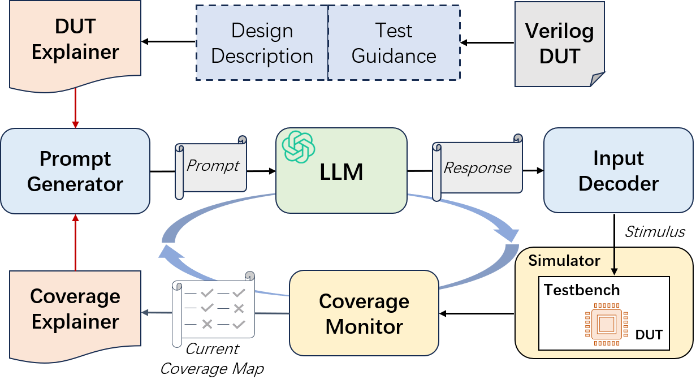

# LLM for Hardware Test Generation
## LAD'24 Paper
You can learn more in our LAD'24 paper (to be appear).

Ruiyang Ma, Yuxin Yang, Ziqian Liu, Jiaxi Zhang, Min Li, Junhua Huang and Guojie Luo*, **VerilogReader: LLM-Aided Hardware Test Generation** in *The First IEEE International Workshop on LLM-Aided Design (LAD'24)*, San Jose, CA, June 2024

{:height="70%" width="70%"}


## Environment Set Up
1> Verilator Installation
https://verilator.org/guide/latest/install.html#
```
# By apt
sudo apt install verilator

# By Compilation
git clone https://github.com/verilator/verilator
cd verilator
autoconf
export VERILATOR_ROOT=`pwd`
./configure
make -j4
```

2> Pyverilog Installation
https://github.com/PyHDI/Pyverilog

```
# pre require
pip3 install jinja2 ply

git clone https://github.com/PyHDI/Pyverilog.git
cd Pyverilog
# must to user dir, or error because no root
python3 setup.py install --user
```

3> OPENAI User Setup
Our framework use OPENAI GPT as our LLM models, so you need an account for OPENAI key. 
```
export OPENAI_API_KEY='xxx'
```

## Framework overview
1> Program Entrance `run.py`
You can set the DUT and the number of experiment trails in that script.

2> Testbench Entrance `src-basic/sim-main.cpp`
You can choose useing LLM or Random for test generation.
You can also set up the parameters for these methods.

3> LLM Guidance code `/llm-guidance`

4> Random Testing code `/random-guidance`
